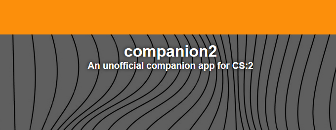

<h1 align="center">companion-2</h1>

</img>

<h3 align="center">An unofficial mobile companion web app for Counter-Strike 2 (CS:2).</h3>

# What does it do?
companion2 allows you to see what is happening in CS:2, remotely start or stop matchmaking or remotely accept a match without being at your computer.

</img>

The remote match accept feature is probably the most useful. Imagine going to get some water, and you can accept the match while you are filling your bottle outside.

# Installation
You need to install the server on your computer.
## 1: Install Python
If you don't have Python installed already, install it from [the official Python website](https://www.python.org/). The application was tested with [Python 3.12.5](https://www.python.org/downloads/release/python-3125/).

## 2: Install dependencies
You need to install some packages first. Use this command:
```
pip install -r requirements.txt
```

## 3: Launch the server
You can launch the server using this command:
```
python main.py
```
This will create a console window hosting the server and information on how to connect your phone. You can minimize the window, but closing it will stop the server.

## 4. Connect your phone
When you launch the server, it will display something like this:
```
---------------------------------------------
You can access companion2 from your phone by entering this
into your preferred browser:

http://192.168.0.100:5000
---------------------------------------------
```
Enter the URL into your preferred browser on your phone.

### That's all! Enjoy!

# Troubleshooting
Here are some common issues and fixes.

## I entered the URL and it is unreachable.
Make sure your phone and PC is on the same network, otherwise it will not work. Also, make sure no other app is using port 5000.

## The server crashes.
Make sure all the dependencies have been installed successfully and no other application is using port 5000.

***Disclaimer: This project is not affiliated with Valve or Counter-Strike.***